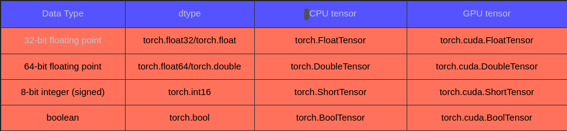

### Joshua Greenfield (@ Educative.io)
#### PyTorch Tensor Manipulation for Machine Learning

[Educative.io PyTorch Course](https://www.educative.io/courses/pytorch-tensor-manipulation/about-this-course?openHLOPage=true)


###### Notable PyTorch Consumers

Tesla Autopilot
Uber's Pyro
HuggingFace Transformers


###### What is a PyTorch tensor

In short, a PyTorch tensor is an n-dimensional array that is the same as a NumPy array or TensorFlow tensor. You can consider a rank 0 tensor as a scalar, a rank 1 tensor as a
vector, and a rank 2 tensor as a matrix. For higher-dimensional, they are rank n tensor. 

Tensors form the fundamental building block of the PyTorch ecosystem. Various components, such as network layers, loss functions, gradient descent, and optimizers rely on underlying tensor operations.

Rank 0 Tensor - scalar
Rank 1 Tensor - vector
Rank 2 Tensor - matrix
Rank 3 Tensor - matrices
Rnak 4 Tensor - vector of matrices


###### Creating a Tensor from a List
Creating a tensor from a list or a nested list is easy.
Import the torch library and call the tensor function.

```python

import torch

a = torch.tensor([1, 2, 3])
b = torch.tensor([1], [2], [3])

print(a)

print(b)


```


###### Creating a tensor from a NumPy array

```python

import torch
import numpy as np

na = np.array([1, 2, 3])
a = torch.tensor(na)
b = torch.from_numpy(na)
print(a)
print(b)

```


###### Creating Special Tensors
* Identity tensors
* Ones tensors
* Zeros tensors


PyTorch provides some useful functions to create special tensors, such as the identity tensors having all zeros or ones.

*   eye() creates an identity tensor with an integer.
*   zeros() creates a tensor with all zeros, the parameter
    could be an integer or a tuple that defines the shape
    of the tensor.
*   ones() creates a tensor with all ones like ones.
    The parameter could be an integer or a tuple that defines
    the shape of the tensor.


```python
import torch

# Create an identity tensor with 3*3 shape.
identity = torch.eye(3)
print(identity)

# Create a tensor with 2*2 shape whose values are all 1.
ones = torch.ones((2, 2))
print(ones)

# Create a tensor with 3*3 shape whose values are all 0.
zeros = torch.zeros((3, 3))

```


###### Creating a Random Tensor
PyTorch provides some useful functions to create a tensor with a random value.

* rand() - It creates a tensor filled with random numbers from a uniform distribution. The parameter is a sequence of
integers defining the shape of the output tensor. It can be
a variable number of arguments or a collection like a list or
a tuple.
* randn() - It creates a tensor filled with random numbers
  from a normal distribution with mean 0 and variance 1. The
  parameter is the same as the rand().
* randint() - Unlike the functions above, this function
  creates a tensor with integer values with low, high and size parameters. 
  * low is an optional with a default 0 value, which means the lowest value.
  * high means the highest value.
  * size is a tuple that defines the shape of the tensor.

```python
import torch

# Create a tensor with a 1*10 shape with a random value
# between 0 and 1.
r0 = torch.rand(10)

print(r0)
print("************************************************")


# Create a tensor with 10*1 shape with random value 
# between 0 and 1.
r1 = torch.rand((10, 1))
print(r1)
print("************************************************")


# Create a tensor with 2*2 shape with random value
# between 0 and 1.
r2 = torch.rand((2, 2))
print(r2)
print("************************************************")


# Create a tensor with 2*2 shape with random value
# from a normal distribution.
r3 = torch.randn((2, 2))
print(r3)
print("************************************************")


# Create an integer type tensor with 3*3 shape with random
# value between 0 and 10.
r4 = torch.randint(high=10, size=(3, 3))
print(r4)
print("************************************************")


# Create an integer type tensor with 3*3 shape with random
# value between 5 and 10.
r5 = torch.randint(low=5, high=10, size=(3, 3))
print(r5)

```


###### Creating a range tensor.
PyTorch also provides a function arange that generates values
in (start; end), like NumPy.


```python
import torch

a = torch.arange(1, 10)
print(a)

```


#### Tensor Metadata

###### Getting type from dtype
The dtype attribute of a PyTorch tensor can be used to
get its type information.

The code below creates a tensor with the float type and
prints the type information from dtype. You can try the
code at the end of this lesson.


```python
import torch
a = torch.tensor([1, 2, 3], dtype=torch.float)
print(a.dtype)
```


###### Getting the number of dim
As shown in the code below, the number of dimensions of a
tensor in PyTorch can be obtained using the attribute ndim
or using the function dim() or its alias ndimensions().

```python
import torch

a = torch.ones((3, 4, 6))
print(a.ndim)
print(a.dim())

```


###### Getting the number of elements
PyTorch provides two ways to get the number of elements of
a tensor, nelement() and numel(). Both of them are functions.

```python
import torch

a = torch.ones((3, 4, 6))
print(a.numel())

```


#### Tensor Types
In this lesson, we discuss the different types supported by
the tensors in PyTorch and show how to cast them into other
types.


###### Why tensor type is important
Similar to other frameworks, PyTorch too defines its types
for its tensor. Some frequently used types are listed in the
table below.

<!-- URL_for_Image: --> 




### Joshua Greenfield (@ Educative.io)
| Data Type |   dtype   |  CPU tensor  |  GPU tensor  |
|-----------|-----------|--------------|--------------|
| 32-bit    | torch.    | torch.       | torch.cuda.  |
| float     | float32/  | FloatTensor  | FloatTensor  |
|           | torch.    |              |              |
|           | float     |              |              |
|           |           |              |              |
|-----------|-----------|--------------|--------------|
| 64-bit    | torch.    | torch.       | torch.cuda.  |
| float     | float64/  | DoubleTensor | DoubleTensor |
|           | torch.    |              |              |
|           | double    |              |              |
|-----------|-----------|--------------|--------------|
| 8-bit     | torch.    | torch.       | torch.cuda.  |
| int       | int16     | ShortTensor  | ShortTensor  |
|-----------|-----------|--------------|--------------|
| 8-bit     | torch.    | torch.       | torch.cuda.  |
| int       | int8      | CharTensor   | CharTensor   |
|-----------|-----------|--------------|--------------|
| bool      | torch.    | torch.       | torch.cuda.  |
|           | bool      | BoolTensor   | BoolTensor   |
|-----------|-----------|--------------|--------------|
| 8-bit     | torch.    | torch.       | torch.cuda.  |
| uint      | uint8     | UInt8Tensor  | UInt8Tensor  |
|-----------|-----------|--------------|--------------|
| 16-bit    | torch.    | torch.       | torch.cuda.  |
| int       | int16     | ShortTensor  | ShortTensor  |
|-----------|-----------|--------------|--------------|
| 16-bit    | torch.    | torch.       | torch.cuda.  |
| uint      | uint16    | UInt16Tensor | UInt16Tensor |
|-----------|-----------|--------------|--------------|
| 32-bit    | torch.    | torch.       | torch.cuda.  |
| uint      | uint32    | UInt32Tensor | UInt32Tensor |
|-----------|-----------|--------------|--------------|
| 32-bit    | torch.    | torch.       | torch.cuda.  |
| int       | int32     | IntTensor    | IntTensor    |
|-----------|-----------|--------------|--------------|
| 64-bit    | torch.    | torch.       | torch.cuda.  |
| int       | int64     | LongTensor   | LongTensor   |
|-----------|-----------|--------------|--------------|
| 64-bit    | torch.    | torch.       | torch.cuda.  |
| uint      | uint64    | UInt64Tensor | UInt64Tensor |
|-----------|-----------|--------------|--------------|
| 64-bit    | torch.    | torch.       | torch.cuda.  |
| float     | float64/  | DoubleTensor | DoubleTensor |
|           | torch.    |              |              |
|           | double    |              |              |
|-----------|-----------|--------------|--------------|


### Meta.ai
[URL for Citation](https://www.meta.ai/c/9dd9413b-4b53-4a11-9617-ae8dc86c050b)
###### Meta wanted the table reordered for the sake of perfectionism:


| Data Type |   dtype   |  CPU tensor  |  GPU tensor  |
|-----------|-----------|--------------|--------------|
| bool      | torch.bool| BoolTensor   | BoolTensor   |
|-----------|-----------|--------------|--------------|
| 8-bit     | torch.int8| CharTensor   | CharTensor   |
|-----------|-----------|--------------|--------------|
| 16-bit    | torch.int16| ShortTensor  | ShortTensor  |
|-----------|-----------|--------------|--------------|
| 32-bit    | torch.int32| IntTensor    | IntTensor    |
|-----------|-----------|--------------|--------------|
| 64-bit    | torch.int64| LongTensor   | LongTensor   |
|-----------|-----------|--------------|--------------|
| 8-bit     | torch.uint8| UInt8Tensor  | UInt8Tensor  |
|-----------|-----------|--------------|--------------|
| 16-bit    | torch.uint16| UInt16Tensor | UInt16Tensor |
|-----------|-----------|--------------|--------------|
| 32-bit    | torch.uint32| UInt32Tensor | UInt32Tensor |
|-----------|-----------|--------------|--------------|
| 64-bit    | torch.uint64| UInt64Tensor | UInt64Tensor |
|-----------|-----------|--------------|--------------|
| 16-bit    | torch.float16| HalfTensor   | HalfTensor   |
|-----------|-----------|--------------|--------------|
| 32-bit    | torch.float32| FloatTensor  | FloatTensor  |
|-----------|-----------|--------------|--------------|
| 64-bit    | torch.float64| DoubleTensor | DoubleTensor |
|-----------|-----------|--------------|--------------|

### Joshua Greenfield (@ Educative.io)
Tensor type is a vital consideration for two primary reasons:

1.  It affects speed and memory usage because the GPU has
    video memory limitations. More bits type takes up more
    memory and requires more computing resources. For example, a matrix A with size 1000*1000. If the dtype is
    torch.float32, this matrix would consume about 3.81MB
    GPU memory (1000*1000*4bytes, each float32 uses 4 bytes.). If the dtype is torch.double, this matrix would
    consume about 7.62MB GPU memory (1000*1000*8bytes, each
    double uses 8 bytes.).

2. Some APIs have strong requirements for types. For example,
   when you train a model about a classification task, you need to calculate some metrics. The tensor type of input
   of some API requires the torch.long type.

###### CrossEntropyLoss
This criterion computes the cross entropy loss between input
logits and target.

It is useful when training a classification problem with C
classes. If provided, the optional argument weight should be
a 1D Tensor assigning weight to each of the classes. This is
particularly useful when you have an unbalanced training set.

[URL for Citation](https://pytorch.org/docs/stable/generated/torch.nn.CrossEntropyLoss.html)

*Parameters*

*   weight (Tensor, optional) – a manual rescaling weight given to each class. If given, has to be a Tensor of size C and floating point dtype.

*   size_average(bool, optional) – Deprecated (see reduction). By default, the losses are averaged over each loss element in the batch. Note that for some losses, there are multiple elements per sample. If the field size_average is set to False, the losses are instead summed for each minibatch. Ignored when reduce is False. Default: True

*   ignore_index(int, optional) – Specifies a target value that is ignored and does not contribute to the input gradient. When size_average is True, the loss is averaged over non-ignored targets. Note that ignore_index is only applicable when the target contains class indices.

*   reduce (bool, optional) – Deprecated (see reduction). By default, the losses are averaged or summed over observations for each minibatch depending on size_average. When reduce is False, returns a loss per batch element instead and ignores size_average. Default: True

*   reduction (str, optional) – Specifies the reduction to apply to the output: 'none' | 'mean' | 'sum'. 'none': no reduction will be applied, 'mean': the weighted mean of the output is taken, 'sum': the output will be summed. Note: size_average and reduce are in the process of being deprecated, and in the meantime, specifying either of those two args will override reduction. Default: 'mean'

*   label_smoothing (float, optional) – A float in [0.0, 1.0]. Specifies the amount of smoothing when computing the loss, where 0.0 means no smoothing. The targets become a mixture of the original ground truth and a uniform distribution as described in [Rethinking the Inception Architecture for Computer Vision](https://arxiv.org/abs/1512.00567). Default: 0.0


###### Specifying tensor types when creating tensors
The default tensor type is torch.int64 for integer tensors
and torch.float64 in case of float tensors.

We can check the tensor's type from dtype attribution of a tensor.

torch.tensor() has a dtype parameter, we could assign a type
by ourselves as shown below.

a = torch.tensor([1, 2, 3])
b = torch.tensor([1, 2, 3], dtype=torch.float)


```python
import torch

a = torch.tensor([1, 2, 3])
print("The dtype for a is {}".format(a.dtype))

b = torch.tensor([1, 2, 3], dtype=torch.float)
print("The dtype for b is {}".format(b.dtype))

```


###### Creating tensors from specified APIs
PyTorch provides some useful functions to create tensors
with the specified type.

* FloatTensor: This function creates tensors with torch.float32 type.
* IntTensor: This function creates tensors with torch.int32 type.
* DoubleTensor: This function creates tensors with torch.float64 type.
* LongTensor: This function creates tensors with torch.long type.

```python
import torch

d = torch.FloatTensor([1, 2, 3])
e = torch.FloatTensor([1, 2, 3])

```


###### Casting tensors into different types
The Tensor class has the method to(), which can cast tensors
into different types. To cast a tensor, call its to() method
and pass the dtype as the argument, as shown in the code below.

```python
import torch

b = torch.tensor([1, 2, 3], dtype=torch.float)
print("The dtype for b is {}".format(b.dtype))

c = b.to(dtype=torch.int64)
print("The dtype for c is {}".format(c.dtype))

```


###### Casting tensors into different device type
One of the most important features of PyTorch tensors is
that they can work on GPU devices. However, to enable that,
we need to first copy the tensor to a GPU. We can do this
using the to() function. Moreover, it could cast tensors
between different device types.

There is a parameter device in to(). We can pass the device
id. If you don't specify any device, the tensor would be
running on the CPU.

The to() function can take as an argument the device id where
we want to run the tensor. If you don't specify any device,
by default the tensor would be run on the CPU.


```python
import torch
# Select the cpu device for running the tensor.
a = torch.tensor([1, 2, 3])
b = a.to('cpu')

```


#### Selecting Elements from a Tensor

###### Selecting tensor with index
If you are already familiar with the NumPy array,
you can use the same methods to select tensors by
[] operations

Take a 2-dimensional tensor as an example. Let's consider it as a matrix.

* tensor[2, 3]: Get only one value.
* tensor[:, 1]: Get the second column from the tensor.
* tensor[1, :]: Get the second row from the tensor.

For higher-dimensional tensors. the operations are the same.
Such as tensor[:, 2, :].

```python
import torch

a = torch.arange(1, 10).reshape((3, 3))

print("Original Tensor: \n")
print(a[1,1])


```

###### Selecting tensor with index_select
PyTorch provides a function index_select which enables us to
select some elements from a tensor with indices.

At first, we need to create a tensor(Long type) that indicates the indices we want to select. Since we want to use
index to locate the element in a tensor, this tensor must be of Long type.

index_select requires the following parameters:

* The first parameter is the tensor we want to select.
* dim: It indicates the dimension in which we index. In this
       example, the tensor is a 2-dimensions tensor. dim=0
       means the row, dim=1 means the column.
* index: The 1-D tensor containing the indices to index.


```python
import torch

a = torch.arange(1, 10).reshape((3, 3))

indices = torch.LongTensor([0, 2])

result = torch.index_select(a, dim=0, index=indices)
print(result)

```

###### Selecting tensor with a mask
The mask tensor is BoolTensor, which identifies which elements are chosen. The shape of the mask tensor and the original tensor doesn't need to match, but they must be broadcastable.

A mask is quite similar to a bitmasking in C and C++ bit operations. Select the element when the corresponding location is True in the mask.

In short, PyTorch enables us to pass a tensor of Boolean
type to masked_select, which selects desired elements from
another tensor.

The first parameter is the original tensor you want to select and the second is the mask tensor.

Unlike other functions, the result of masked_select is a one-dimensional tensor.


```python
import torch

matrixT = torch.arrange(1, 10).reshape((3,3))

maskBT = torch.BoolTensor([
  [True, False, True],
  [False, False, True],
  [True, False, False]
])

print("The mask tensor is: \n{}".format(maskBT))
print("The original tensor is: \n{}".format(matrixT))
result = torch.masked_select(matrixT, maskBT)
print("The result is {}".format(result))

```


#### Changing the Shape of a Tensor


###### Reshaping a tensor
If you already have one tensor, but the shape is not what
you expect, shape() is the function you need. It allows us
to create a tensor with the same data and number of original tensor elements.

The function shape() requires two parameters. The first parameter input is the tensor to be reshaped. The second
parameter is the shape which is a tuple of int, the new shape.


```python

import torch

matrixTa = torch.arange(1, 9)
print("The original tensor. \n")
print(matrixTa)

matrixTb = torch.reshape(matrixTa, (2, 4))
print("The reshape tensor with shape (2, 4) \n")
print(matrixTb)

matrixTc = torch.reshape(matrixTa, (2, -1))
print("The reshape tensor with shape (2, -1) \n")

```


###### Squeezing a Tensor
Sometimes, the size of some dimensions of a tensor is 1.
For example, a tensor's shape is (10, 2, 1, 5), and we want
to remove the third dimension. The function squeeze() is the
function we need.

* We can't squeeze a dimension if the size is greater than 1.
* We can squeeze multiple dimensions simultaneously in one function call. But, it would squeeze all.

The function squeeze() has two parameters:
* input: The tensor we want to perform squeeze on.
* dim: The dimension we want to perform squeeze on. It's optional. If dimension is set, the tensor is squeezed only in this dimension.


```python
import torch

vectorT1 = torch.ones((3, 1, 2))
print("The original shape of vectorT1 is {}".format(vectorT1.shape))
print("The original vectorT1 tensor is {}".format(vectorT1))

vectorT2 = torch.squeeze(vectorT1, dim=1)
print("The new shape of vectorT2 is {}".format(vectorT2.shape))
print("The new tensor is {}".format(vectorT2))

vectorT3 = torch.ones((3, 1, 2, 1, 2))
print("The original shape of vectorT3 is {}.".format(vectorT3.shape))

```


###### Un-squeezing a Tensor
Since we can remove one dim from a tensor, we may want to
add one more dim to a tensor as well. For example, a tensor's
shape is (3, 3), you could add one dim like (3, 1, 3) by
unsqueeze().

In NumPy, the function expand_dims() does the same work as
unsqueeze().

* dim: This parameter indicates the index at which to insert the dimension.


```python
import torch

vectorT4 = torch.ones((3,3))
print("The original shape of vectorT4 is {}.".format(vectorT4.shape))
print("The original vectorT4 tensor is {}.".format(vectorT4))

vectorT5 = torch.unsqueeze(vectorT4, dim=1)
print("The shape of vectorT4 has been mutated in vectorT5 to be {}.".format(vectorT5.shape))
print("The new tensor is {}.".format(vectorT5))

```


